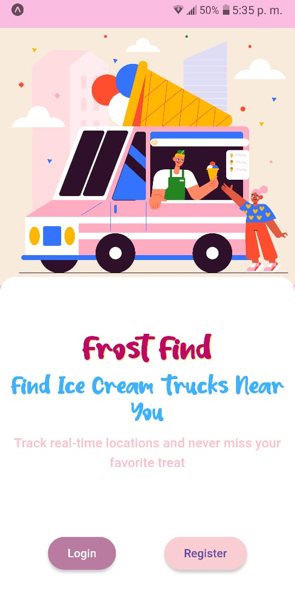
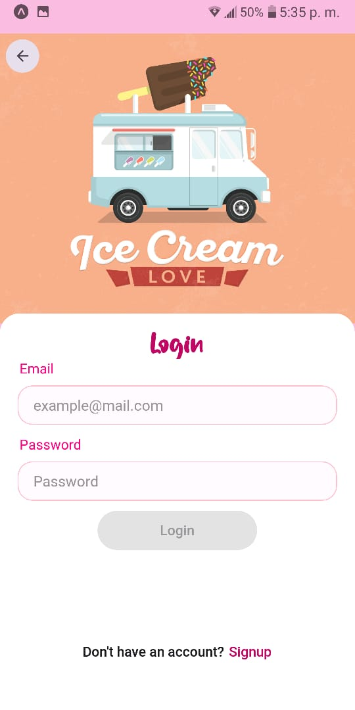
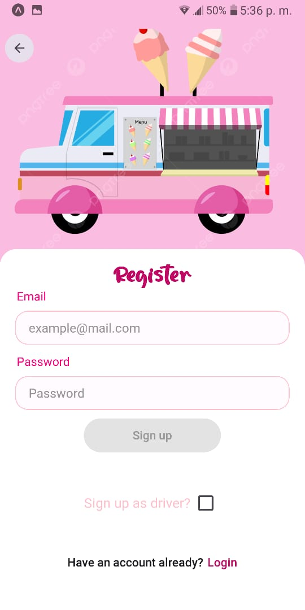
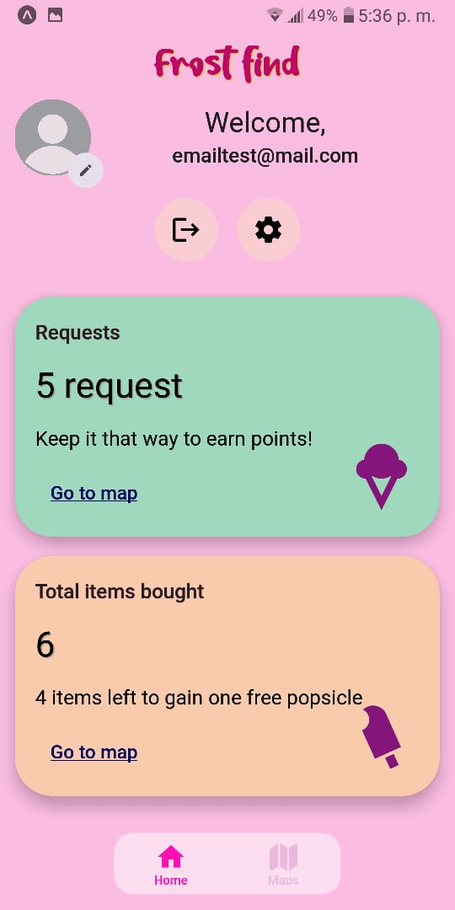
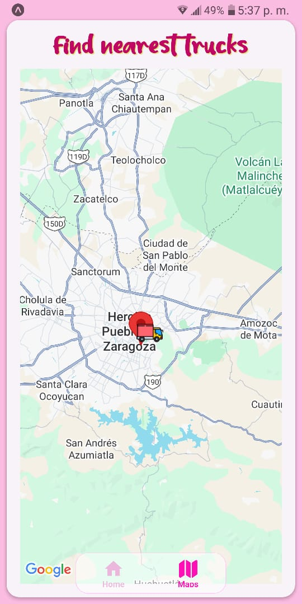

# 🍦 Frost Find

**Real-time ice cream truck tracking for customers and drivers**

[](https://reactnative.dev/)
[](https://expo.dev/)
[](https://www.typescriptlang.org/)
[](https://firebase.google.com/)

---

## 📱 About The Project

Frost Find is a mobile application that bridges the gap between ice cream truck drivers and their customers through real-time location tracking. Built with React Native and Firebase, it provides separate experiences for drivers sharing their location and customers tracking nearby trucks.

**The Challenge:** Ice cream trucks are mobile businesses that lack a consistent way to notify customers of their location. Customers often miss their favorite treats simply because they didn't know a truck was nearby.

**The Solution:** A real-time tracking system where drivers can broadcast their location, and customers can see active trucks on a map with distance calculations and estimated arrival times.

---

## ✨ Key Features

### For Customers
- 🗺️ **Live Map Tracking** - See all active ice cream trucks in real-time
- 📍 **Distance & ETA Calculation** - Know how far trucks are and estimated arrival time
- 🎁 **Rewards System** - Earn points with each purchase toward free treats
- 🔔 **Request Notifications** - Track your requests and purchase history
- 🎨 **Intuitive UI** - Clean, playful design with smooth loading states

### For Drivers
- 🚚 **Location Broadcasting** - Share your location with customers when you're active
- 📊 **Driver Dashboard** - View your stats, earnings, and customer requests
- 🔐 **Role-Based Access** - Separate driver interface with business-focused features
- ⚡ **Real-time Updates** - Instant synchronization via Firebase Firestore

### Technical Highlights
- 🔐 **Firebase Authentication** - Secure email/password authentication
- 🔄 **Real-time Database Sync** - Firestore listeners for live location updates
- 🧮 **Smart Distance Algorithm** - Haversine formula with urban multiplier (1.35x) for realistic road distance estimation
- 🎣 **Custom Hooks Architecture** - Reusable hooks for auth, location, and driver data
- 💀 **Skeleton Loading States** - Smooth UX with custom animated placeholders
- ⚠️ **Error Handling** - Comprehensive error states throughout the app
- 🎯 **TypeScript Throughout** - Full type safety across components and hooks

---

## 🛠️ Tech Stack

**Core**
- **React Native** (0.81.4) - Cross-platform mobile framework
- **Expo** (~54.0) - Development and deployment toolchain
- **TypeScript** (5.9.2) - Type-safe development
- **Expo Router** (6.0) - File-based routing with protected routes

**Backend & Database**
- **Firebase Authentication** - User management with email/password
- **Firebase Firestore** - Real-time NoSQL database for location and user data
- **Expo Location** - Native location services integration

**UI & Navigation**
- **React Native Maps** - Interactive map components with custom markers
- **React Native Paper** (5.14.5) - Material Design component library
- **Expo Linear Gradient** - Smooth gradient effects
- **Custom Animations** - Built with React Native's Animated API

**State Management**
- Custom React hooks (`useAuth`, `useDriverLocation`, `useActiveDrivers`, `useNotifications`)
- Context API for global auth state
- Local state management with useState/useReducer

---

## 🏗️ Architecture Highlights

### Custom Hooks Pattern
The app leverages a hooks-first architecture for clean separation of concerns:

```typescript
// useAuth - Manages authentication state and Firebase auth operations
// useDriverLocation - Handles real-time location tracking for drivers
// useActiveDrivers - Subscribes to Firestore for live driver data
// useNotifications - Manages push notification permissions and state
```

### Real-time Data Flow
1. Drivers broadcast location via Firestore `onSnapshot` listeners
2. Customer app subscribes to active drivers collection
3. Distance calculations happen client-side using Haversine formula
4. UI updates automatically when new data arrives

### Distance Calculation
```typescript
// Haversine formula for great-circle distance
// Urban multiplier (1.35x) accounts for road routing vs straight-line distance
// Provides realistic ETAs without external routing API calls
```

### Role-Based Navigation
- Firestore user documents contain `role` field (`customer` | `driver`)
- Expo Router handles protected routes based on authentication state
- Separate tab navigations render conditionally based on user role

---

## 📸 Screenshots

### Onboarding & Authentication
<table>
  <tr>
    <td></td>
    <td></td>
    <td></td>
  </tr>
</table>

### Customer Experience
<table>
  <tr>
    <td></td>
    <td></td>
  </tr>
</table>

*Driver dashboard screenshots available in `/screenshots` directory*

---

## 🚀 Getting Started

### Prerequisites
- Node.js (v18+ recommended)
- npm or yarn
- Expo CLI (`npm install -g expo-cli`)
- iOS Simulator (Mac) or Android Studio for emulation
- Expo Go app on physical device (optional)

### Installation

1. **Clone the repository**
```bash
git clone https://github.com/yourusername/frost-find.git
cd frost-find
```

2. **Install dependencies**
```bash
npm install
```

3. **Set up Firebase**
   - Create a Firebase project at [console.firebase.google.com](https://console.firebase.google.com)
   - Enable Authentication (Email/Password provider)
   - Create a Firestore database
   - Add your Firebase config to environment variables

4. **Configure environment variables**
```bash
# Create .env file in root directory
EXPO_PUBLIC_FIREBASE_API_KEY=your_api_key
EXPO_PUBLIC_FIREBASE_AUTH_DOMAIN=your_auth_domain
EXPO_PUBLIC_FIREBASE_PROJECT_ID=your_project_id
# ... other Firebase config values
```

5. **Run the app**
```bash
# Start Expo development server
npm start

# Run on iOS simulator
npm run ios

# Run on Android emulator
npm run android
```

### Firestore Structure
```javascript
// users collection
{
  uid: string,
  email: string,
  role: 'customer' | 'driver',
  createdAt: timestamp
}

// activeDrivers collection
{
  driverId: string,
  location: {
    latitude: number,
    longitude: number
  },
  timestamp: timestamp,
  isActive: boolean
}
```

---

## 🗺️ Roadmap

**Current MVP includes:**
- ✅ Real-time location tracking
- ✅ Distance/ETA calculations (estimated)
- ✅ Rewards system foundation
- ✅ Role-based authentication
- ✅ Error handling & loading states

**Planned Features:**
- 🔄 **Mapbox Directions API** - Accurate road routing and turn-by-turn directions
- 🔔 **Push Notifications** - Alert customers when trucks are nearby
- 📸 **Profile Photo Upload** - User avatars and driver verification
- 🧪 **Testing Suite** - React Testing Library & Jest integration
- 🌐 **Multi-language Support** - Spanish and English localization
- 💳 **In-app Payments** - Direct ordering and payment processing
- 📊 **Driver Analytics** - Revenue tracking and customer insights

---

## 💡 Lessons Learned

### React Native Adaptation
Coming from web development (React/Next.js), adapting to React Native's layout system was the biggest learning curve. Flexbox behaves differently, and views don't follow traditional CSS box model rules. It took several days of trial and error to understand why layouts would "pile up" or break unexpectedly.

**The breakthrough:** Understanding that React Native uses Flexbox as the default layout system, with `flexDirection: 'column'` as the default (opposite of web). Once this clicked, building complex layouts became natural.

### Custom Component Development
Building the skeleton loading component was a proud moment. Creating smooth animations with the Animated API, ensuring proper spacing, and having components gracefully transition from loading to loaded state – this felt like crossing a threshold from "learning" to "building."

### Firebase Real-time Architecture
Implementing real-time location updates taught me the importance of:
- Proper listener cleanup to avoid memory leaks
- Optimizing Firestore queries to minimize reads
- Handling offline states and reconnection logic
- Security rules for role-based data access

### TypeScript in Mobile Development
Maintaining type safety across hooks, components, and Firebase operations prevented countless bugs. The upfront cost of proper typing paid dividends during refactoring and feature additions.

---

## 🤝 Contributing

This is a portfolio project, but feedback and suggestions are welcome! Feel free to:
- Open issues for bugs or feature requests
- Submit pull requests for improvements
- Share ideas for enhancements

---

## 📦 Download & Install

**Android Development Build Available**

Download the latest APK: [Frost Find v1.0.0](https://expo.dev/accounts/gerortiz/projects/frost-find/builds/c05d79f4-bfd4-4783-a01f-3202c5630678)

*Note: This is a development build for testing. Enable "Install from unknown sources" on your Android device.*

### Installation Steps:
1. Download the APK to your Android device
2. Enable installation from unknown sources in Settings
3. Open the APK file and install
4. Launch Frost Find!

---

## 📬 Contact

**Developer:** [Gerson Ortiz]

- Portfolio: [https://gerson-portfolio-page.vercel.app/](https://gerson-portfolio-page.vercel.app/)
- LinkedIn: [https://www.linkedin.com/in/gersonortizv/](https://www.linkedin.com/in/gersonortizv/)
- Email: contacto.gersonortiz@gmail.com
- GitHub: [@gerOrtiz](https://github.com/gerOrtiz)

---

## 📄 License

This project is available for portfolio and educational purposes. Please contact me for commercial usage inquiries.

---

## 🙏 Acknowledgments

- Ice cream truck illustration assets from [Pikisuperstar](https://www.freepik.es/vector-gratis/ilustracion-mercado-comida-callejera-dibujada-mano_45979596.htm#fromView=search&page=2&position=14&uuid=fa1408f4-7147-46ee-8665-08c436748c14&query=ice+cream+truck), [Artmonkey](https://www.freepik.es/vector-gratis/diseno-furgoneta-helados_993497.htm#fromView=search&page=1&position=5&uuid=fa1408f4-7147-46ee-8665-08c436748c14&query=ice+cream+truck), [Nat Tanaes](https://pngtree.com/freepng/cute-sweet-pink-ice-cream-truck_7129347.html)
- Map integration powered by Google Maps via react-native-maps
- Firebase for real-time backend infrastructure
- Expo team for incredible developer experience
- Sweet affogato font by - [Sweet Affogato](https://fontbundles.net/stefani-letter/885399-sweet-affogato) font by Stefani Letter via 1001fonts.com
- Popsicle icon by [Freepik](https://www.flaticon.com/free-icons/ice-cream-stick)
---

**Built with ❤️ and a lot of ice cream** 🍦